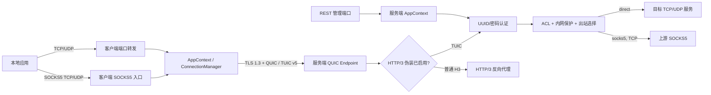

# TUIC 系统架构设计

本文档基于当前仓库实现，描述 `tuic-core`、`tuic-client`、`tuic-server` 与测试工程之间的边界、主要数据流和运行时行为。当前实现使用 TUIC 协议版本 5，并以 QUIC/TLS 1.3 作为传输基础。

## 1. 设计目标

- 通过单条 QUIC 连接复用 TCP 连接、UDP 会话、认证和心跳。
- 同时支持低延迟的 QUIC Datagram UDP 中继和可靠的 QUIC Stream UDP 中继。
- 将协议编解码、客户端入口、服务端策略和运维接口分离。
- 通过 TLS、UUID/密码认证、ACL 和默认内网保护建立分层安全边界。
- 允许客户端和服务端独立选择拥塞控制、MTU、窗口和运行时模型。

## 2. 仓库组成

| 模块 | 职责 | 关键入口 |
| --- | --- | --- |
| `tuic-core` | TUIC v5 命令、地址模型、序列化/反序列化、QUIC 连接模型 | `protocol`、`model`、`marshal`、`unmarshal` |
| `tuic-client` | 配置解析、QUIC 连接管理、本地 SOCKS5、TCP/UDP 端口转发 | `config.rs`、`connection`、`socks5`、`forward.rs` |
| `tuic-server` | QUIC 服务、认证、ACL、出站路由、TLS/ACME、HTTP/3 伪装、REST API | `server.rs`、`connection`、`acl.rs`、`camouflage.rs`、`restful.rs` |
| `tuic-tests` | 客户端和服务端的端到端集成测试 | `tests/integration_tests.rs` |

## 3. 总体架构

## 4. 协议与数据通道

`tuic-core` 定义以下 TUIC v5 命令：

| 类型码 | 命令 | 用途 |
| --- | --- | --- |
| `0x00` | `Authenticate` | 使用 UUID 和密码派生信息认证复用连接 |
| `0x01` | `Connect` | 建立一条 TCP 双向中继流 |
| `0x02` | `Packet` | 携带 UDP 数据包或其分片 |
| `0x03` | `Dissociate` | 释放 UDP 会话 |
| `0x04` | `Heartbeat` | 保持连接活跃 |

地址可编码为域名、IPv4、IPv6 或 `None`。UDP 非首分片可省略重复地址信息。

### 4.1 TCP 数据流

1. 本地应用连接 SOCKS5 入口，或连接 `local.tcp_forward.listen`。
2. 客户端从 `ConnectionManager` 取得已有 QUIC 连接；连接失效时自动重建。
3. 客户端打开 QUIC 双向流并发送 `Connect` 命令。
4. 服务端等待认证完成，解析目标地址，执行 DNS、ACL 和出站选择。
5. 服务端通过直连或 SOCKS5 出站建立目标 TCP 连接，然后双向复制数据。

### 4.2 UDP 数据流

1. SOCKS5 UDP ASSOCIATE 或 UDP 固定转发为来源端点分配 `assoc_id`。
2. 数据包超过允许大小时由模型层分片，接收端按 `pkt_id` 重组。
3. `native` 模式使用 QUIC Datagram，保留原生 UDP 的不可靠特性。
4. `quic` 模式使用 QUIC 单向流传输 UDP 包，可靠但开销和队头影响更高。
5. 空闲监视器、`Dissociate` 和缓存回收共同清理会话。

客户端将 SOCKS5 UDP 会话放在 `0x0000..=0x7fff`，固定 UDP 转发会话放在 `0x8000..=0xffff`，避免两类入口的关联 ID 冲突。

## 5. 客户端架构

### 5.1 配置与启动

客户端通过 `-c/--config` 读取 TOML、YAML 或 JSON/JSON5。格式选择优先级为：

1. `TUIC_FORCE_TOML`
2. `TUIC_CONFIG_FORMAT`
3. 文件扩展名
4. 文件内容推断

启动后创建共享 `AppContext`，其中包括连接管理器、SOCKS5 服务、两类 UDP 会话缓存和首次连接状态。

### 5.2 连接生命周期

- `eager`：启动时连接，失败则启动失败。
- `lazy`：首次本地请求到来时连接，首次失败则进程退出。
- `loop`：首次本地请求到来后持续重试，成功前每秒重试一次。
- 首次连接成功后，后续请求复用连接；检测到连接关闭时自动重建。
- 心跳任务保持连接，垃圾回收任务清理过期 UDP 分片和会话。

### 5.3 本地入口

- SOCKS5 TCP CONNECT。
- SOCKS5 UDP ASSOCIATE，可配置本地用户名和密码。
- 多条 TCP 固定转发。
- 多条 UDP 固定转发，每条规则有独立空闲超时。
- `local.server` 可以为空；此时只运行固定转发。若 SOCKS5 和固定转发都未配置，客户端会直接退出。

### 5.4 到服务端的上游代理

`relay.proxy` 可让客户端先通过一个支持 UDP ASSOCIATE 的 SOCKS5 代理访问 TUIC 服务端。该路径承载的是底层 QUIC UDP 流量，不等同于服务端的业务出站配置。

## 6. 服务端架构

### 6.1 启动阶段

1. 解析配置。
2. 解析 `data_dir`，将相对证书路径转换为相对于该目录的绝对路径。
3. 初始化日志、TLS 和 QUIC 传输参数。
4. 绑定 UDP 监听地址并启动 QUIC Endpoint。
5. 按需启动 REST API；每个入站 QUIC 连接由独立 Tokio 任务处理。

### 6.2 TLS 与连接分类

- 仅配置 TLS 1.3。
- `tls.self_sign=true` 时启动时生成自签名证书。
- 使用证书文件时，每 30 秒检查并热加载证书和私钥变化。
- 开启防探测伪装：连接分类器区分 TUIC 事件和普通 HTTP/3 请求；对于后者，不再采用反向代理，而是默认直接返回 400 Bad Request 静态错误页面，以避免资源浪费。

### 6.3 认证与共享状态

服务端 `AppContext` 保存用户表、在线连接计数、在线连接缓存、流量计数和取消令牌。连接必须在 `auth_timeout` 内发送有效 `Authenticate`，否则关闭。认证成功后才允许处理 TCP/UDP 任务。

### 6.4 ACL 与出站决策

每个 TCP/UDP 目标按配置顺序匹配 ACL。规则可以按地址、CIDR、域名/通配符、端口和协议选择：

- `direct` 或 `default`：使用默认直连出站。
- `drop`：丢弃请求。
- 自定义名称：选择 `outbound.<name>`。
- `hijack`：将目标改写为指定地址。

没有显式 ACL 命中时，`experimental.drop_loopback` 和 `drop_private` 默认阻止回环及私网目标；随后使用默认出站。直连出站支持地址族偏好、多个源 IP 随机选择和 Linux 网络接口绑定。

服务端 SOCKS5 出站当前只完整支持 TCP。UDP 选中 SOCKS5 出站时默认丢弃；即使设置 `allow_udp=true`，当前也会直接发送 UDP，而不是经 SOCKS5 转发，以避免文档误导。

## 7. 防探测伪装 (Camouflage)

伪装功能与 TUIC 共用 QUIC/TLS 监听端口且默认启用。启用后：

- TUIC 流量继续进入协议事件循环。
- 普通 HTTP/3 请求、探测请求或无效握手包将直接收到静态的 `400 Bad Request` 响应页面并关闭流。
- （相较于旧版本）移除了代理转发后端的能力，从而移除了 `reqwest` 等重量级依赖，确保服务端极为轻量且不受 SSRF 等攻击干扰。

## 8. REST 管理接口

REST API 使用独立 TCP 监听地址，提供在线连接、详细远端地址、流量统计、统计重置和踢下线功能。状态保存在内存中，服务重启后清空。所有请求都要求 `Authorization: Bearer <secret>` 头；应只监听管理网卡或回环地址，并设置强随机密钥。

## 9. 并发与资源管理

- QUIC 连接、流和本地转发均由 Tokio 任务驱动。
- 客户端通过锁保护首次连接和连接替换，避免并发建立多条首连接。
- UDP 分片、SOCKS5 会话和固定转发会话使用有容量或空闲时间约束的缓存。
- 服务端每个认证用户维护在线计数、连接缓存与原子流量计数。
- `tokio_runtime=auto` 在 CPU 数不超过 2 时选择单线程运行时，否则选择多线程运行时。

## 10. 安全边界与部署原则

- 生产环境优先使用可信 CA 证书或 ACME，不应启用客户端 `skip_cert_verify`。
- UUID 不是密码；每个用户应配置独立、随机且足够长的密码。
- 保持 `drop_loopback=true` 和 `drop_private=true`，仅用精确 ACL 放行必要内网目标。
- 不要将 REST API 直接暴露到公网。
- 谨慎启用 0-RTT；早期数据存在重放风险，应结合业务威胁模型评估。
- QUIC 基于 UDP，部署时必须同时放行服务端监听的 UDP 端口。

## 11. 已知限制

- 服务端 SOCKS5 出站尚不支持真正的 UDP-over-SOCKS5。
- REST 状态与流量统计不持久化。
- ACME 失败会回退自签名证书，客户端若未信任该证书将无法连接。
- HTTP/3 伪装是反向代理，不是通用 Web 应用服务器。
- 配置结构使用 `deny_unknown_fields` 的部分会拒绝拼写错误或未实现字段，应在升级后先验证配置。
